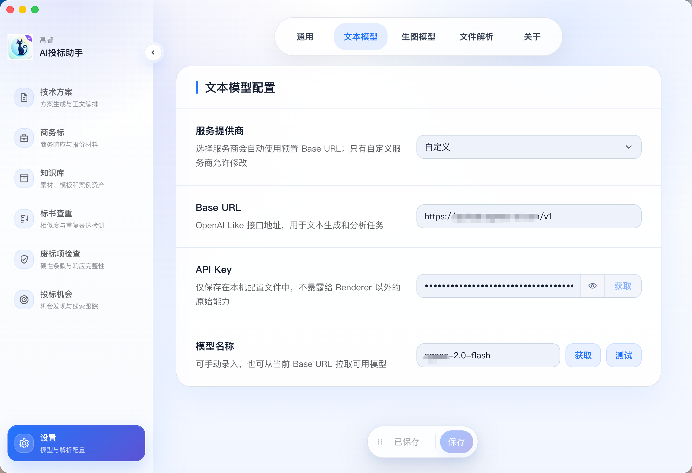
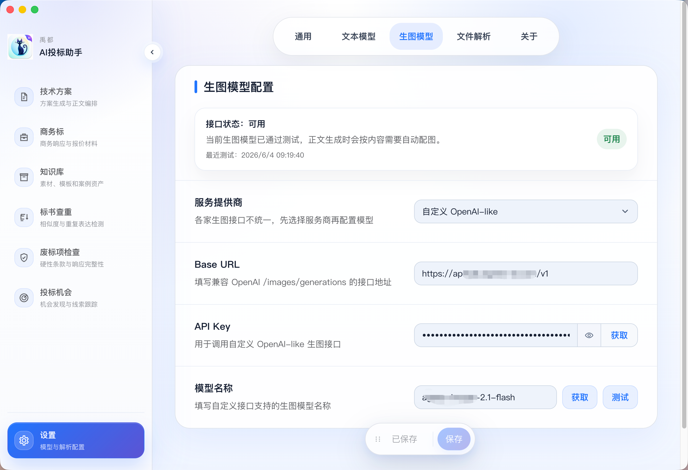

<p align="center">
  
</p>

# 禹都AI投标助手

禹都AI投标助手是一款面向招投标场景的本地桌面客户端，聚焦招标文件解析、技术方案生成、知识库复用、标书查重、废标项检查和 Word 导出等流程。项目以 Electron 桌面端为核心，强调本地工作区、可恢复后台任务、模型配置可控，以及从招标文件到标书正文的连续工作流。

<p align="center">
  
  
  
  
</p>

## 产品预览

### 技术方案正文生成


技术方案模块按目录小节生成正文，生成进度、章节状态和字数会持续展示。后台任务会写入本地工作区，页面切换不会中断已经启动的生成流程。

### 模型与解析配置



文本模型支持 OpenAI-like 接口配置，可设置服务商、Base URL、API Key 和模型名称，并提供模型拉取与测试能力。



生图模型用于正文生成过程中的自动配图能力，支持独立的 OpenAI-like 生图接口配置，方便把文本生成和图像生成拆分到不同服务。


文件解析支持本地解析、MinerU 精准解析 API 和 MinerU-Agent 轻量解析 API。默认优先使用本地解析，复杂扫描件或高质量解析场景可切换到 MinerU。

## 核心能力

- 招标文件导入与 Markdown 化展示
- 技术方案目录生成、正文生成和持续编辑
- 企业知识库资料沉淀、复用和匹配
- 标书查重与重复表达检测
- 废标项检查与响应完整性检查
- 技能管理与 Word 导出排版优化能力
- 文本模型、生图模型和文件解析方式独立配置
- Mermaid、图片、表格等 Markdown 内容导出为 Word
- Electron 本地工作区存储，流程状态可恢复

## 项目结构

```text
.
├── client/      # 核心桌面客户端，Electron + Vite + React + TypeScript
├── analytics/   # 独立 Cloudflare Workers 埋点服务和统计看板
├── tools/       # 独立文档解析与 MinerU 验证工具
├── docs/        # README 图片等项目文档资源
├── sql/         # 工作区 SQLite 目标表结构说明
└── README.md
```

## Client

客户端源码位于 `client/`，根目录没有 `package.json`，所有客户端命令都在 `client/` 下执行。

```bash
cd client
npm ci
npm run build
```

开发启动：

```bash
cd client
npm run dev
```

本地打包：

```bash
cd client
npm run dist:win
npm run dist:mac
```

打包产物输出到 `client/release/`。本地构建后可按平台和版本归档为 `client/release/Windows/<version>/` 与 `client/release/macOS/<version>/`，该目录不会提交到 Git。

## Analytics

`analytics/` 是独立埋点服务，用于接收客户端上报并提供统计看板。

```bash
cd analytics/worker
npm install
npm run dev
```

```bash
cd analytics/dashboard
npm install
npm run dev
```

## Tools

`tools/` 用于放置独立文档解析、MinerU 验证、排查脚本等不直接进入客户端包体的工具。

## 🙏 致谢

本项目基于 [FB208/OpenBidKit_Yibiao](https://github.com/FB208/OpenBidKit_Yibiao) 进行二开，遵从 [GNU Affero General Public License v3.0](https://github.com/FB208/OpenBidKit_Yibiao/blob/main/LICENSE) 开源协议。
