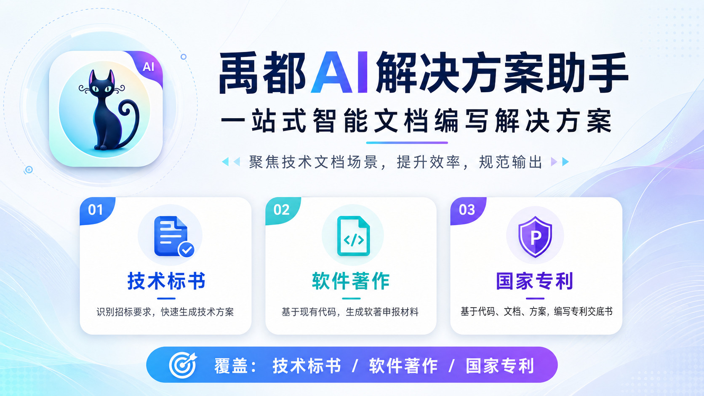
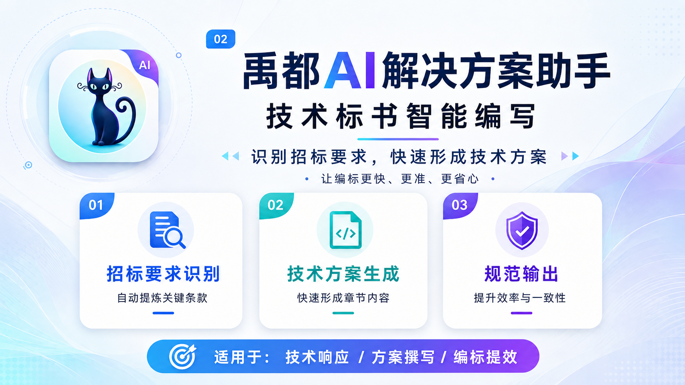
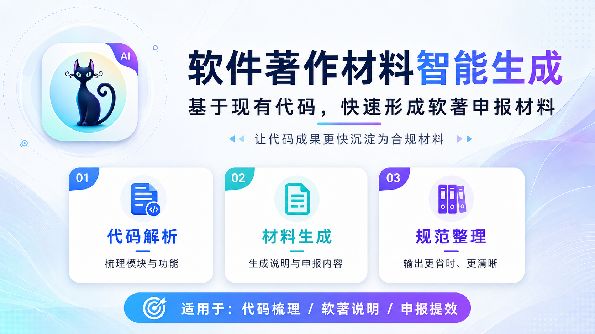
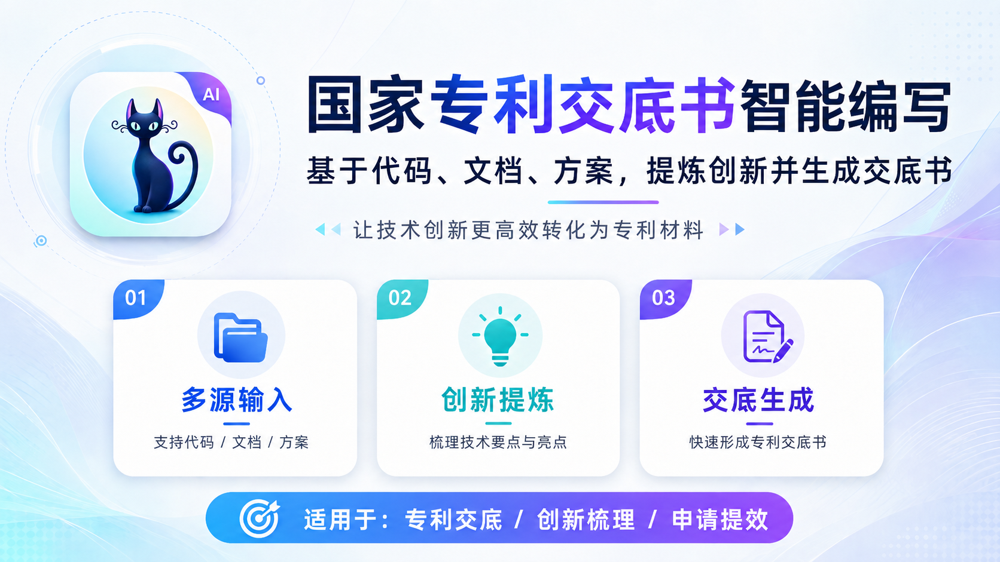

<p align="center">
  
</p>

# 禹都AI解决方案助手

禹都AI解决方案助手是一款面向招投标、软件著作、国家专利和技术文档场景的本地 AI 工作台。它把资料导入、内容解析、方案生成、交底书编写、查重检查、修订留档和 Word 导出整合到同一套桌面流程中，帮助团队把分散的文档、代码、方案和经验沉淀成可复用、可交付的成果。

<p align="center">
  
  
  
  
</p>

## 宣传图册










## 客户端下载

前往 [Releases](https://github.com/liwg1995/YuduBid/releases) 下载 Windows 或 macOS 客户端安装包。

## 能力概览

### 技术标书

围绕招标资料解析、目录生成、正文编排、知识库复用、标书查重和废标项检查形成完整辅助链路，让技术响应、方案撰写和交付检查更清晰。知识库资产作为技术方案流程中的素材沉淀与复用能力，为后续标书编写提供历史案例、模板和结构化内容支撑。

### 软件著作

基于现有代码和说明材料，辅助整理软著源码材料、申请表、手册和交付文件，减少重复复制、格式整理和材料归纳成本。

### 国家专利

从项目文档、代码、方案和技术说明中挖掘可保护技术点，辅助完成专利挖掘、交底书生成、查新分析和修订迭代，帮助创新内容更快转化为专利材料。

## 产品特色

- 本地桌面工作台，资料、草稿和流程状态保存在本机工作区。
- 文本模型、生图模型和文件解析能力可独立配置。
- 支持 Markdown 预览、结构化编辑和 Word 文档导出。
- 长任务在后台执行，页面切换不会中断生成、检查和导出流程。
- 面向中文技术文档场景设计，覆盖招投标、软著、专利和知识资产管理。

## 适用场景

- 招投标团队编写技术标书、整理商务响应和检查废标风险。
- 软件企业基于代码和说明材料准备软著申报文件。
- 技术团队从项目成果中提炼创新点并生成专利交底书。
- 组织沉淀历史案例、模板、素材和知识条目，提升后续交付效率。

## 开发者用户

客户端源码位于 `client/`。安装依赖、构建和本地打包都在该目录下执行。

```bash
cd client
npm ci
npm run build
```

开发启动：

```bash
cd client
npm run dev
```

本地打包：

```bash
cd client
npm run dist:win
npm run dist:mac
```

## 🙏致谢

本项目基于 [FB208/OpenBidKit_Yibiao](https://github.com/FB208/OpenBidKit_Yibiao) 进行二开，感谢作者提供肩膀！
遵从 [GNU Affero General Public License v3.0](https://github.com/FB208/OpenBidKit_Yibiao/blob/main/LICENSE) 开源协议。
