> 本文档描述如何使用本软件进行技术标书从无到有的生成，对应【招投标】-【技术方案】模块

## 打开软件进入首页

首页介绍了本软件的基本概况，支持招投标工作流、公文写作、软件著作、专利生成四大功能模块

后续陆陆续续增加其他大的功能，敬请期待！

## 招投标

进入招投标一级标题下的【技术方案】模块

1. 进入【STEP 01 上传招标文件】,点击上传招标文件后的【选择文件】按钮，上传准备好的招标文件 技术部分内容
2. 上传完成后，自动进行解析，展示招标文件内容

3. 点击进行下一步，进入【STEP 02 招标文件解析】

4. 可进行【只解析关键项】、【完整解析】两种方式，其中【只解析关键项】作为默认，不对本项目的人员、时间等信息进行强制要求。【完整解析】对项目的人员、时间等信息有强制的要求，若没有提供可能存在解析失败的风险。

5. 以【只解析关键项】举例，点击【开始解析】，进行招标文件技术部分的解析

6. 完成解析后，可进行【重新解析】等操作
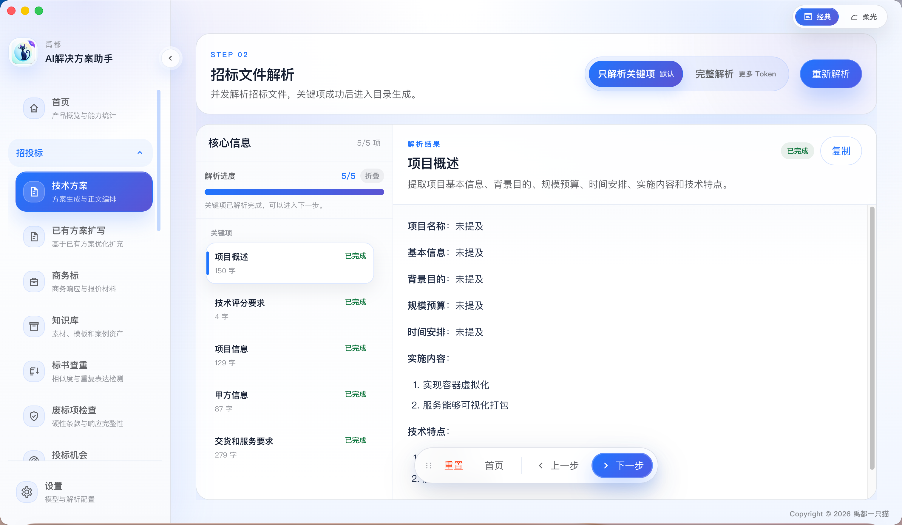

7. 解析完成，点击下一步，进入【STEP 03 生成目录】

8. 点击目录生成左侧的设置按钮，可对目录生成的策略进行配置，包括【自由生成】、【按评分项对齐】

9. 若是没有提交评分的内容，选择【自由生成】即可。我以【自由生成】举例

10. 点击【开始生成】，等待片刻，进行目录的生成。这里需要等待，因为在依据招标内容，调用大模型，要求越多，等待时间越久。

11. 目录生成完成后，可对目录自定义修改、完善，也可以重新进行生成

12. 点击【下一步】，进入【STEP 4 全局事实设定】，根据设定，补齐一些需要的内容，可进行修改

13. 点击【下一步】，进入【STEP 5 正文生成】

14. 进入正文生成后，首先进行设置。点击【正文生成】旁边的设置按钮，对生成的正文进行配置

  - 根据自身需求，对表格需求、最低字数、正文生成并发进行配置。使用Agnes-ai的，正文生成并发建议设置为`2`，免费的并发给的不是很多
  - 可以选择AI生图，前提是需要配置好AI生图的模型，如何设置见，若没有，则使用`Mermaid`生图

15. 配置完成后，可点击【保存配置】，也可点击【开始生成】

16. 点击【开始生成】，进行标书的生成，这里需要等待的时间会比较近，毕竟要生正文，还要生图

 - 编排正文结构

  - 生成正文中

  - 生成完成后进行审计，审计有问题自动进行修复，这里也需要等一些时间（若有生成失败章节，稍后进行失败章节的重新生成）

  
  - 生成配图
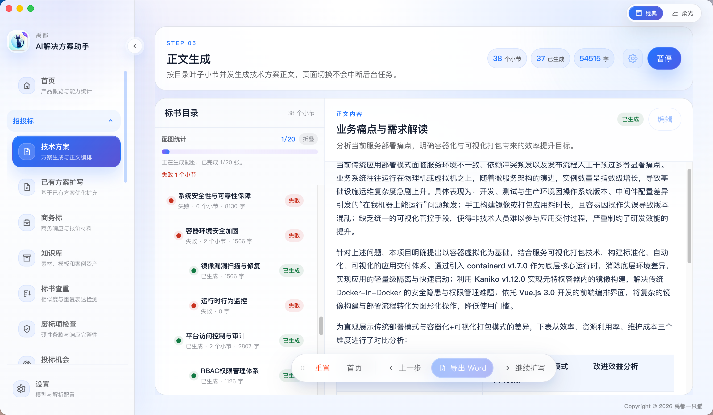

  - 完成生成正文
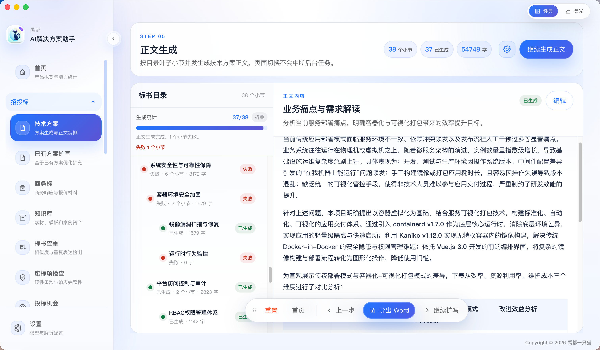

  - 若有上图中生成失败章节，点击右上角【继续生成正文】，对生成失败的内容进行重新生成，会默认再打开设置，默认即可，点击【开始生成】
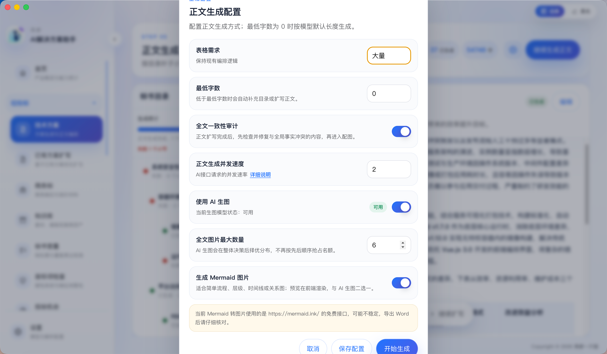
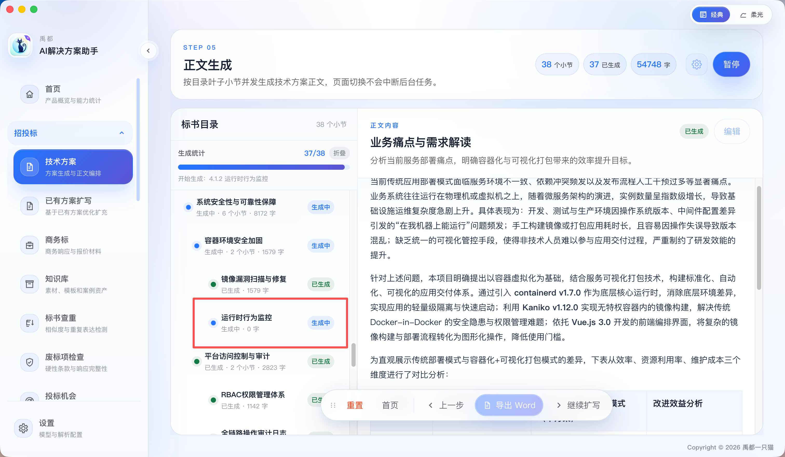

17. 完成标书的生成，可对每个生成的章节进行手动编辑
> 【继续扩写】功能，暂未开放，后续完善

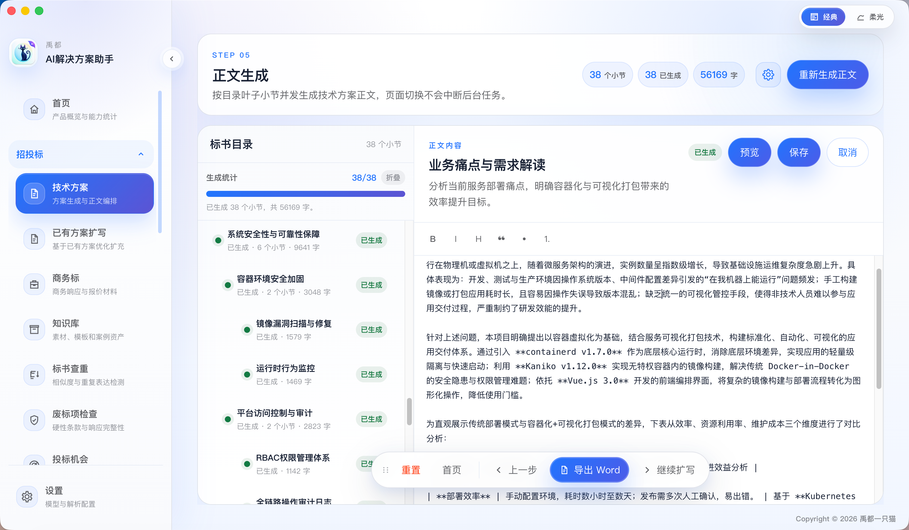

18. 生成完成并没问题后，可进行WORD的导出。若是启用【设置】-【技能管理】-【word-optimization】，则导出来是优化后的格式

  
  - 导出，选择存储位置
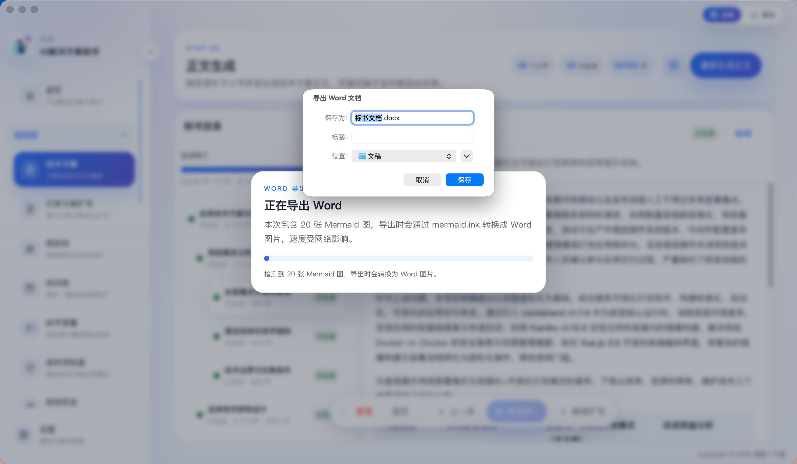

  - 进行导出
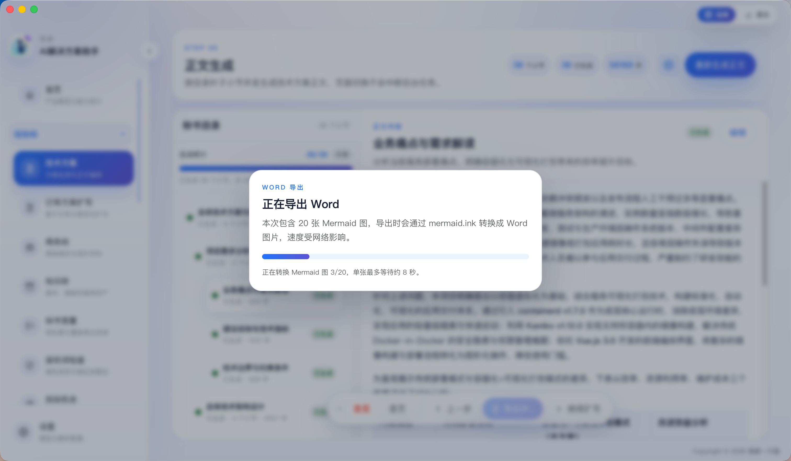
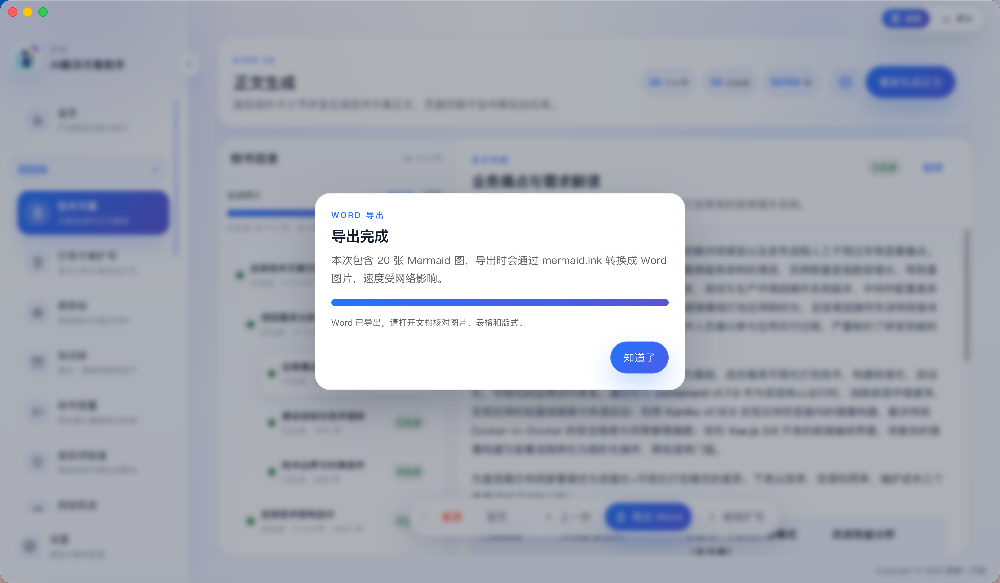

  - 打开导出的优化后的格式
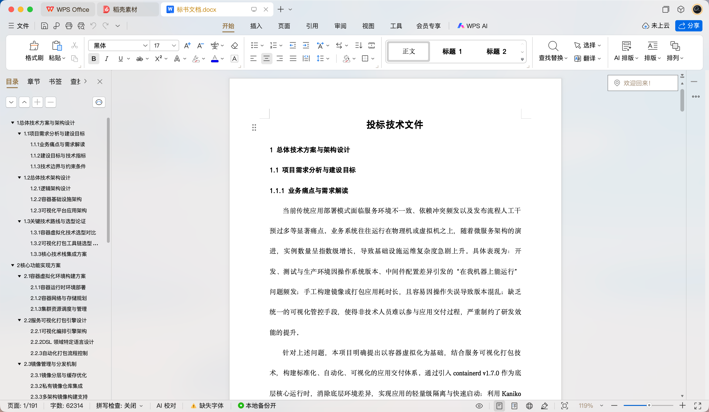

19. 若是没有开启【设置】-【技能管理】-【word-optimization】，则导出来的是默认的格式
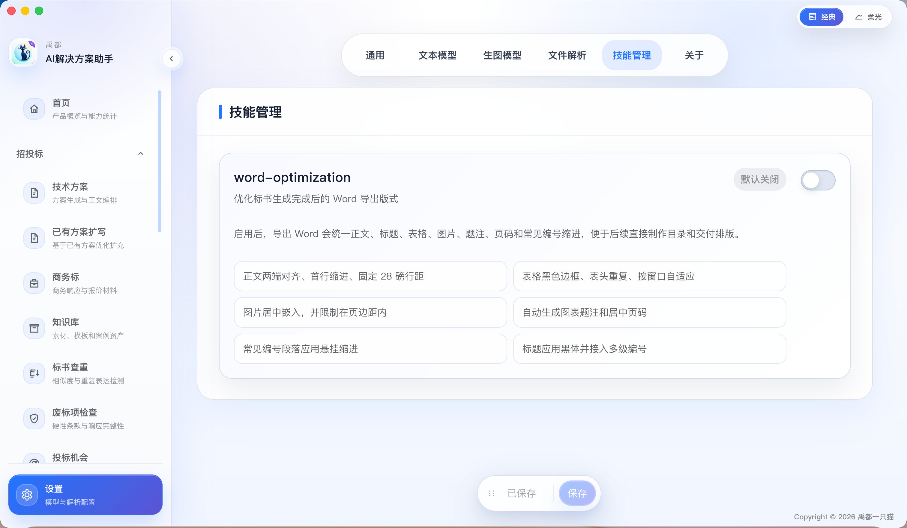
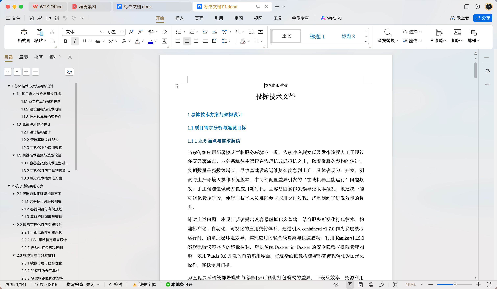