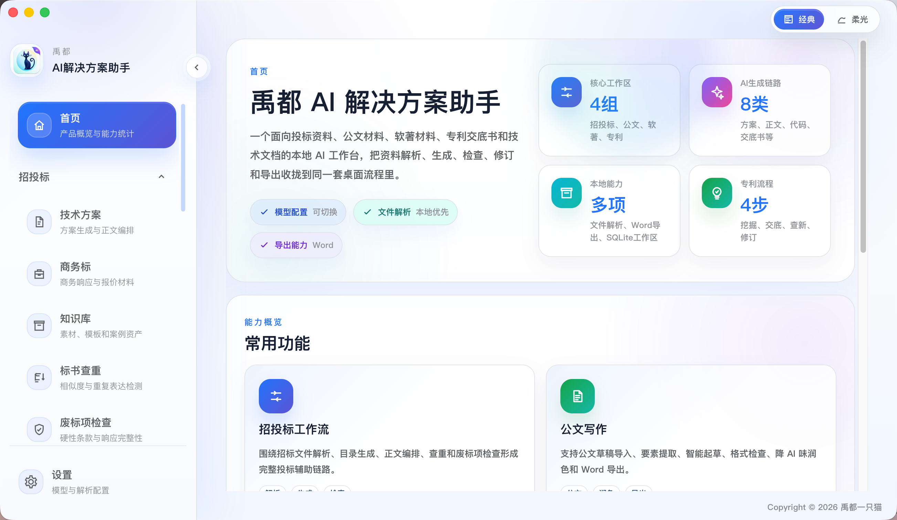
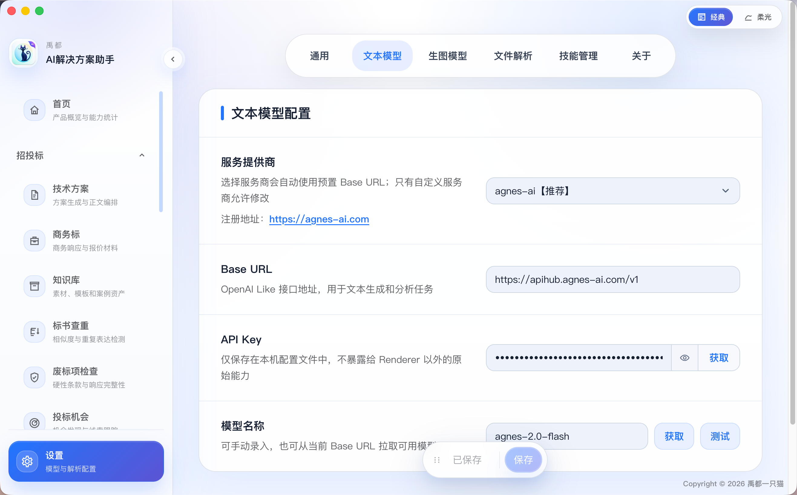
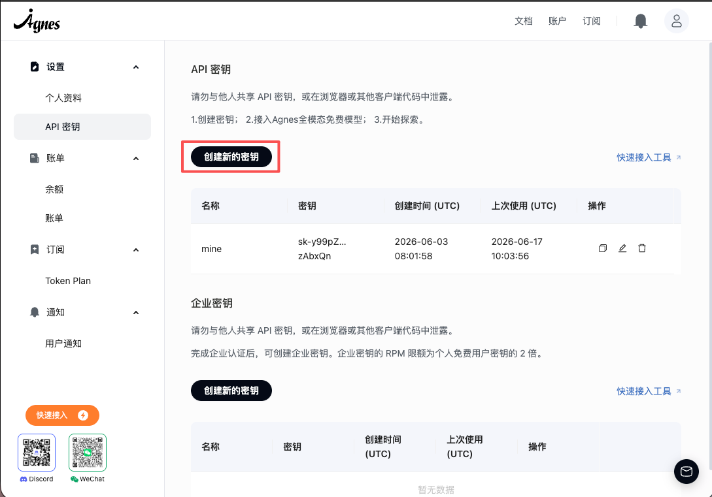
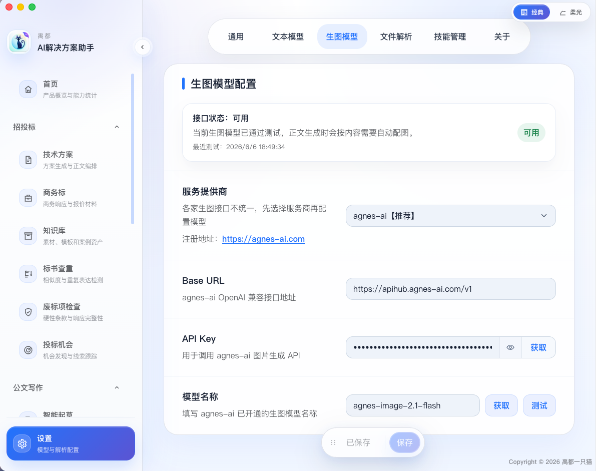
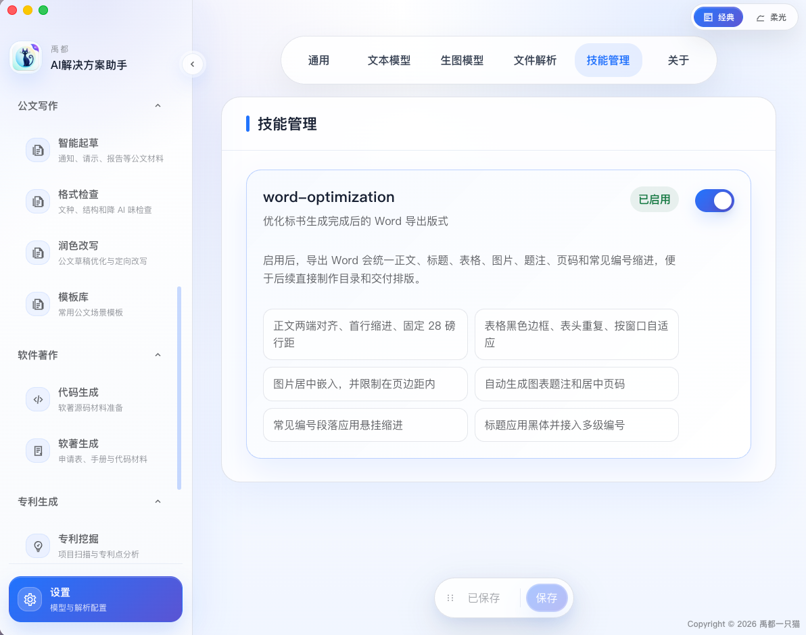
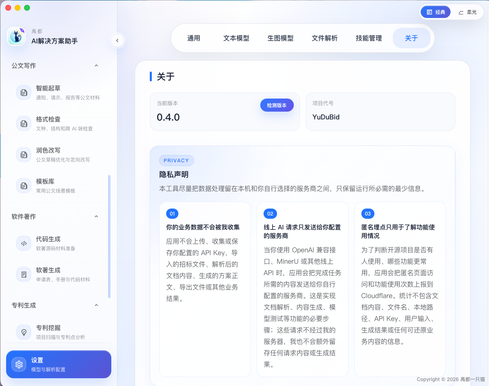
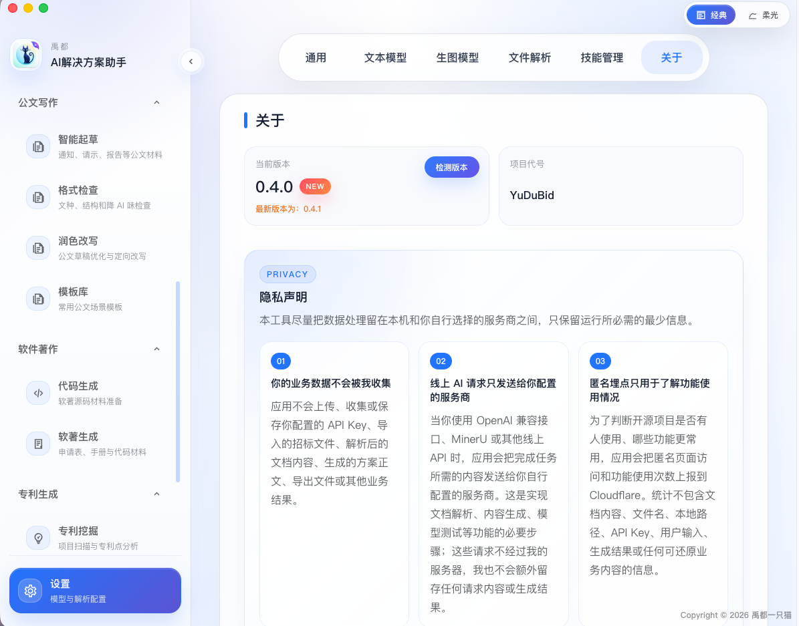
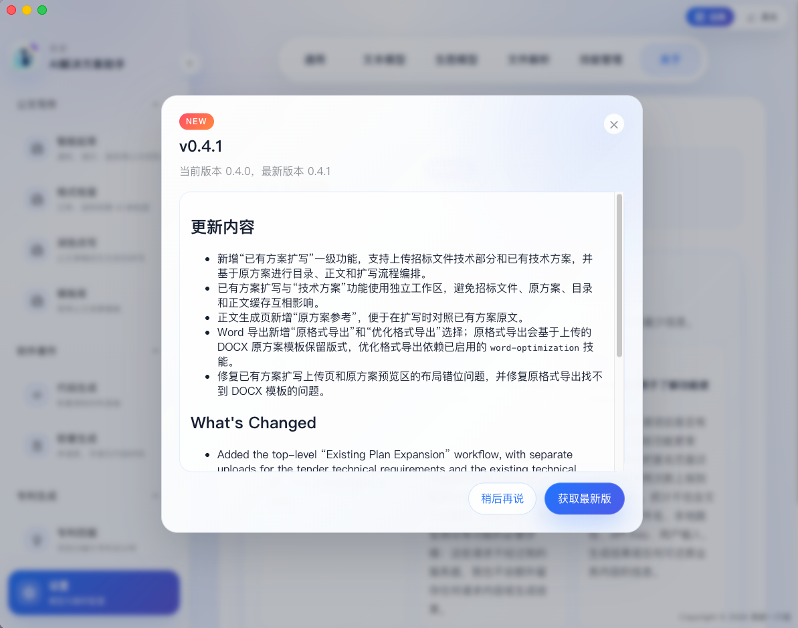

> 🛠️  本文件描述使用之前的设置，是标书、公文、软著、专利生成的前提。

## 打开软件界面

## 进入设置界面

### 进入文本模型设置

> 该步骤是所有功能的前提，必须进行文本模型的设置。本项目提供`Agnes-AI`、火山方舟、小米`token plan`、`DeepSeek`、龙猫以及自定义方式

- 👍推荐使用`Agnes-AI`，因为提供的模型不收费，前往[agnes-ai](https://agnes-ai.com/)进行注册即可，有其他更好的模型，可以自行选择或者自定义

- 注册完成后，在后台创建新的密钥

- 模型名称记得点击获取一下，使用当前最新模型`agnes-2.0-flash`，并测试一下。测试没有问题，点击[保存]，即可完成文本模型的设置

### 进入生图模型设置

> 该步骤可做可不做，因为投标文件中的图，若没有生图模型，则使用`Mermaid`进行生图。本项目提供`Agnes-AI`、火山方舟、`Google AI Studio`以及自定义方式

- 👍推荐使用`Agnes-AI`，同样是因为提供的模型不收费，前往[agnes-ai](https://agnes-ai.com/)进行注册即可，有其他更好的模型，可以自行选择或者自定义

- 模型名称记得点击获取一下，使用当前最新模型`agnes-image-2.1-flash`，并测试一下，注意这里测试生图可能时间较长，不影响其他的操作。测试没有问题，会显示[可用]，点击[保存]，即可完成生图模型的设置

### 文本解析设置
该步骤可以忽略，若是想使用`MinerU`精确解析，自行注册即可。[默认即可]

### 技能管理设置

技能管理提供`word-optimization`，用于针对标书的导出进行格式优化，默认不开启，需要的话进行[开启]即可。

### 关于界面

- 该界面展示软件版本信息，可检测远程仓库中最新版本，点击[检测版本]，若远程有更新，即可显示最新版本是什么

- 点击[NEW]，可查看远程最新版本的情况，同时可获取最新版，下载下来覆盖安装即可
> `Windows`、`Mac`版支持【设置】-【关于】-【检测版本】进行更新，更新方式获取`github`中最新版本的包并下载。

> 以另一种方式支持`app`内进行更新，但仍然需要重新安装部署，原因是`app`未签名

